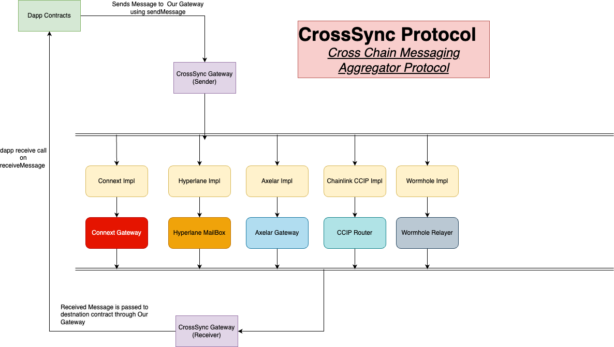

# CrossSync Protocol
Cross Chain Messaging Aggregator Protocol




### Detailed Bigger Demo Link :
https://www.loom.com/share/378283b419c7410e9852169f49378115?sid=679c6298-b646-47df-a052-82bd81c053a2


## About
CrossSync Protocol is a cross-chain messaging aggregator protocol. You may have used Hyperlane, Connext, Wormhole, Axelar, Chainlink CCIP, etc, but these protocols come with various challenges for developers and users. Firstly, they support different types of chains, one is available on some chains and another on some other chains. They also have syntax differences. To integrate one, two, or even three of them, developers need to implement numerous interfaces and understand the workings of the underlying protocol, relayer fees, etc.

To address these challenges and provide a common Interface and Gateway for interacting with multiple messaging interoperability protocols CrossSync has been made, With this users only need to implement and interact with CrossSync Protocol Gateway. They have to call the sendMessage function of the CrossSync Gateway and specify the route ID for sending messages, for example, 1 for Using Axelar, 2 for CCIP, 3 for Connext, 4 for Hyperlane, and 5 for Wormhole. CrossSync Protocol handles the rest and converts all the payload into the payload required for the messenger protocol, you don't have to bother about different kinds of domain IDs, chain names, etc. Additionally, users no longer have to implement individual interfaces to receive messages on the destination chain. A single receiveMessage function is all they need to integrate for receiving the payload.

### Benefits 
- A common relayer fee makes it easy for developers to integrate any of these protocols with ease and less hassle.
- Many of these protocols are available on different kinds of chains, ones you combine all of them into same protocol, you can have cross chain messaging available on almost all chains now
- With Auto Routing users get the lowest fees for cross chain call if many protocols are available on same chain.
- The design of this protocol has be kept modular, any protocol can be integrated easily by just deploying implementation contract for it.
- This protocol benefits users as well as developers from the percepective of UI, Fees, ease of using, ease of integrating, etc.

This protocol is available on Polygon ZKEVM, Mantle Testnet, Scroll Testnet, Goerli, Sepolia, and Mumbai. All contract addresses and abi and details are present in the GitHub repo.

## Testing 
### ROUTE IDs:
- 0: NATIVE(Not Supported Yet)
- 1: AXELAR
- 2: CCIP
- 3: CONNEXT
- 4: HYPERLANE
- 5: WORMHOLE


## CrossSync Gateway Interfaces

### For Sending Message/Call Contract on Destination Chain
```
interface ICrossSyncGateway {

    struct MessagingPayload{
        address to;
        bytes data;
    }

    function sendMessage(
        uint256 _destinationChainId,
        uint256 _routeId,
        MessagingPayload calldata _payload,
        bytes calldata _routeData
    ) external payable;
}
```

### For Receiving Message on Destination Chain
```
interface ICrossSyncReceiverImplementer {

    function receiveMessage(
        uint256 _sourceChainId,
        address _sourceAddress,
        bytes calldata _payload
    ) external payable ;          
}
```

## Networks
- Hyperlane : chains -> Polygon ZKEvm 1442, Mantle Testnet 5001
- Connext : chains -> Polygon ZKEvm 1442, goerli 5, Mumbai 80001
- Axelar : chains -> Polygon ZKEvm 1442, goerli 5, Mumbai 80001, Mantle Testnet 5001, Scroll  534351 
- CCIP: chains  -> Mumbai 80001, Sepolia 
- Wormhole: chains -> mumbai 80001, goerli 5


## Gateway and Implementation  Contracts
https://github.com/mbcse/CrossSync/blob/main/contractAddresses.json


## Transaction hashes, testing contracts and proofs of working
All these destination contract calls were done through crossSync Gateway.
- Axelar : https://testnet.axelarscan.io/gmp/0x60917f0de99db08d7d95f4939ac17462456c5de9e3a87a5c0e91cb72b9d04e8d
- Wormhole: https://wormholescan.io/#/tx/9bd69d2c44b89264b927e50922d7879e7e97a708d65320c9c09295daf130fac2?network=TESTNET
- Connext: https://testnet.connextscan.io/tx/0xff380364ce68512503f310c878f49d882dc6c48da220678b07cb1a4e41422857
- Chainlink CCIP : https://ccip.chain.link/msg/0x657a8c3824e66d734eb03c9d722251cb1757169d9e7af52e4d7d370e521c0f45
- Hyperlane: https://explorer.hyperlane.xyz/message/0xa77b91fc04c9071c277e0048fe60bc957b7faab48e067eaece7ec2eade3306ce

Smart contracts(Verified) used on multiple chains to test the working of crossSync Gateway, You can also try:- 
- Polygon Mumbai : https://mumbai.polygonscan.com/address/0x6211F610C39B4F1F641db47235Feda5524bf7C7f#code
- Polygon ZkEvm Testnet : https://testnet-zkevm.polygonscan.com/address/0x86D4fC6698FE93dF34A138bf319D48Ed913bDEE9#code
- Scroll Testnet: https://sepolia.scrollscan.dev/address/0xBCDA557c6817c1F6f2157d3d7A3da0dc8846Eb88#code
- Mantle Testnet: https://explorer.testnet.mantle.xyz/address/0xf94634a05024f61269DB101A0247e9A7FFb912D2/contracts#address-tabs
- Sepolia : https://sepolia.etherscan.io/address/0x80D259cB8552aDd69c699eF139579fFf64115697#code
- Goerli : https://goerli.etherscan.io/address/0x1cF1c423076e01716417deAf315AE2DBa4D777Ab#code

## Future Plans
- Implement Auto Routing
- Implement Token and Other sends
- Implement Common Relayer Fee
- Implement Pay in any token Functionality
- Launch for public use
